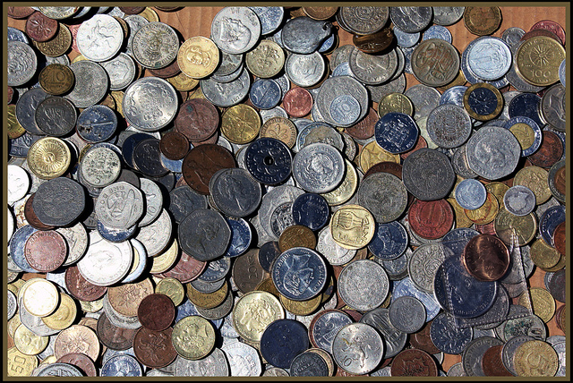

# Arrays

Up until now we have typically worked with only one piece of information - for example integers, floats, chars etc. In many cases - such as our grade calculator - all the information was of the same type, yet we still created seperate variables to store individual grades. Wouldn't it be much simpler if we could collect similar information like this in the same place? 

## Collections

An array is just another word of a collection. Examples of arrays can be found in <a href="http://en.wikipedia.org/wiki/Matrix_(mathematics)" target="_blank">mathematics</a>, <a href="http://www.vla.nrao.edu/" target="_blank">astronomy</a>, and even <a href="https://www.google.ie/search?q=array+plate&newwindow=1&source=lnms&tbm=isch" target="_blank">biology.</a> What sort of things do people typically collect? What sort of collections can you think of?




In the case of all of these collections, each consists of the same **type** of thing - stamps, coins etc. In programming that same is true. A collection of data, or an **array** must contain items that all have the same data type. For example, an array of ints could contain people's ages, an array of floats might contain bank balances, or an array of chars could store a student's letter grades.

## Initialising

What sort of information do you need to know in order to be able to create, or initialise, a loop?

Like any variable, it will need a name. You also need to know what sort of information your working with, so you have to know variable type. Finally you need to know how many items should go in the array.

Typically the syntax for an array is as follows:

```
 int numbers[5] = {1,2,3,5,8};

 char letters[3] = {'A', 'B', 'C'};
 
 float myArray[10];

```

## Accessing Elements

It is important to note that the first item of an array has an index of 0 (lives at index 0?) as this is often the source of off-by-one errors. For example,to print the letter **A**  from the array `letters[3]` above, you select the 0th item from the array with the following piece of code:

```
 printf("%c \n ", letters[0]);
```

## Combining with Loops

You can quickly scan items to or prints items from an array by using an incrementer to both keep track of the iterations of your loop and the location (index) in the array that you want to access.

<code data-gist-id="43a7c5c405d31f8670ca"></code>


## Working with unknows

Let's say that you want your user to enter all their test results  - the only problem is you don't know in advance how many exams they've taken. Take a look at the code below and see if you can understand what's going on.

