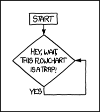

% Loops
% Domhnall O'Hanlon
% February 24, 2015

### Part 3: Loops

### Overview
We've already seen a few instances where we wanted to repeatedly print information to the screen. Performing repetitive tasks is one of the things that computers are exceptionally good at doing. In this chapter we'll introduce a variety of different loops that you can use to write better programs.

### Looping
If you've never done any programming before loops can be a challenging topic due to their unfamiliarity. If you think about it in more general terms, how would you give a computer instruction to do something over and over again?
How would you avoid getting stuck in an _infinite loop_?



### Start, Middle, End

When you creating a loop in any programming language you will have tell it when and where to start. Starting a loop is known as __initialising__ the loop.

Next you will have some code to run - for example increment at counter, print some text etc. - while the loop is running. 

Finally you need an end condition. Once this condition is met or exceeded then the loop should exit gracefully.

\newpage
### While Loops

A `while` loop, as the name implies, executes while a certains condition is true. Once the test condition is no longer true then the loop is broken and code execution moves on to the next line. Try this snippet to get started:

```C
 int main(){
     
     int counter = 0;

        while(counter < 10){
            printf("the value of the counter is: %d \n", counter);
            counter++
        }
     
    printf("successfully exited the while loop! \n");

     return 0;
 }

```
\newpage
### Syntax
A typical `while` loop will begin with a test condition:
```
    while(testIfTrue){
        code to run while true;
        incrementer;
}
```
If the test is true then the code inside the loop (i.e between the braces) will run - keep in mind that each line must end with a semi-colon. Finally, you'll need to have some sort of incrementer that gets updated during each pass through the loop. This is essential so that you don't get stuck in an infinte loop.

### Example

Try the previous example with different test conditions. For example using `while (counter <= 30)` will cause the loop to run an extra time. Similarly you could continue executing the loop while the counter is _not_ equal to a certain value. `while (counter != 30)`

Be careful if you are changing the direction of the inequality!

### Visualisation


### Programming Challenge

Here's a simple example you can code using `while` loops. Which would you preferm, one million euro today or 1 cent, doubled every day for a month (30 days)?

Your loop should run 30 times, doubling the value of your variable each time. 

### Do While

With a `while` loop there is always a possibility that the test condition will never be true and that the code within the loop will never run. 

A `do while` loop differs from a `while` loop in that it will always run at least once, and the conditional check is performed at the end of the loop, rather than at the beginning.

### Do While Syntax

```C
    int loopCounter = 1;

   /* do loop execution */
   do
   {
       printf("number of times this loop has run: %d\n", loopCounter);
       loopCounter++;
   }while( loopCounter < 10 );
```

### Visualisation


### For Loops

The `for` loop contains the starting condition, end condition and incrementer all at the beginning of the loop

###Syntax

```C
 int main(){
     
     int counter;

     for(counter = 0; counter < 10; counter++){
        printf("Hello World!");
     }
     
     return 0;
 }

```

### Visualisation


###Example

```C

/* Print all the even numbers between 0 and 100 in 3 lines of code */
 int main(){
     
     int i;

     for(i = 0; i <=100; i++){
        if(i%2 == 0){
            printf("%d \n", i);
        }
     }
     
     return 0;
 }

```


### Nesting For loops
A quick challenge to really test your understanding so far. 

Create a program that has variables to represent the number of rows and number of colums that a table should have. Then use nested for loop to print a 3 x 3 table to the console.

### Break

Lets say that we have some condidtion which, if met, should break us out of our loop immediatley. In such a scenario we would use a `break;` statement.
Here's a simple example that modifies out doWhile application to exit before it has iterated through the loop 10 times.

```C
 int main(){
     
    int loopCounter = 1;

   /* do loop execution */
   do
   {
        if(loopCounter == 7){
            break;
        }
       printf("number of times this loop has run: %d\n", loopCounter);
       loopCounter++;
   }while( loopCounter < 10 );

     
     return 0;
 }

```


### Continue
Conceptually this is the opposite of a `break` statement. It's behaviour will differ slightly depending on where it is used. In a `for` loop the `continue` statement will cause the conditional test and increment portions of the loop to execute.

When used in a `while` or  `do-while` loop, the `continue` statement causes the program control to pass straight to the conditional tests.

### Switch

Switch statements are used to test a variable for equivalence against a list of given values. It is conceptually similar to an `if-else if-else` block of code.

### Visualisation


### Example 1

```C
int main(){
     int input;
     int type;

     printf("Enter a number \n");
     scanf("%d", &input);

     if(input % 2 == 0){
        type = 0;
     }else{
        type = 1;
     }
     
     switch(type){
        case(0): 
            printf("The number is even\n");
            break;
        case(1):
            printf("The number is odd\n");
            break;
        default:
            printf("Sorry, unknown type of number! \n");
            break;
        }

     return 0;

```


### Example 2
 

```C
   switch(grade)
   {
   case 'A' :
      printf("Excellent!\n" );
      break;
   case 'B' :
   case 'C' :
      printf("Well done\n" );
      break;
   case 'D' :
      printf("You passed\n" );
      break;
   case 'F' :
      printf("Better try again\n" );
      break;
   default :
      printf("Invalid grade\n" );
   }
```


### Fizz Buzz Revisited

Using a loop of your choosing:

  * Print all the numbers from 0 to 30 inclusive.
  * If the number is evenly divisibe by 3 print "FIZZ" instead of the number
  * If it's evenly divisible by 5 then print "BUZZ" instead of that number.
  * If the number is divisible by both 3 && 5 the print FIZZBUZZ