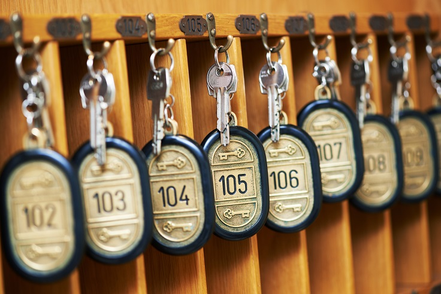

% Hello C...TYI!
% Domhnall O'Hanlon
% March 14, 2017

\setcounter{page}{45}

# Pointers 

The topic of pointers in C is one that many beginners find challenging, but once you get comfortable with them your applications will become more powerful and more efficient. 

## Welcome to the Hotel California

A pointer is a special type of variable (it's actually a constant!) whose value is the memory address of another variable. To help you visualise this, image a hotel with lots of floors, and many rooms on each floor. The rooms are analogous to locations in computer memory in that they don't ever change their pyhsical location or address. The occupants of the rooms however can change - so your hotel visitors are like programming variables, free to come and go as they please and easily replaced by other variables. ~~We can also extend this analogy a bit by considering twin rooms, double rooms, suites etc. These types of rooms might correspond to different types of data~~
<!--  -->


A pointer variable is declared by prefacing its name with an asterisk. The address in memory is a numeric value so it's ok to use an interger as the type, but by starting your variable name with an asterisk (star) rather an a letter you are telling the compiler that this variable is actually a pointer rather than a conventional integer. 


``` C
 int main(){
     int *pointer;
     
     return 0;
 }
```

You can still declare multiple varaible on one line, but each pointer has to start with `*`

``` C
int main(){
    /*one pointer and one integer*/
    int *my_pointer, not_a_pointer;

    /*two pointers*/
    int *first_pointer, *second_pointer;
}
```

## Convention

In many cases the accepted convention is to start a pointer variable with the letter p, for example:

``` C
 int main(){
    //create an integer variable
     int age;

     //create a pointer variable
     int *pAge;
    
     return 0;
 }
```


### Where are variables stored in memory?

To acces memory locations in C use a pointer thingy:

`%p`

We can echo a memory address to the console using something like the following snippet:

``` C
    int i = 42;

    printf("%p ", i);

    return 0;

```

### Some notes on Hex.


### Creating Pointers:

Take for example: `int myInt = 42`, this can store any numeric value between x and y. It has a memory address and we can create `int * pMyInt = &myInt`


## Dereference Pointer

If you want to retrieve the value that a pointer points to (as opposed to the address that it points to) then you use the unary operator, `*`, which is used to dereference the pointer.

``` C
 int i = 42;
 int *prt = &i;

 int main(){
     printf("The address of int i is: %p \n", prt);
     printf("The value stored  at i is: %d \n", *prt);
     
     return 0;
 }

```


## Arrays and Pointers
 create and array of vars
 loop through the array and print it's contents, and memory pointer.

 int luckyNums[6] = [4,8,15,16,23,42];

    printf(" Element \t Address \t Value")
    for (i=0; i<6; i++){
        printf(" luckyNums[%d] \t %p \t %d", i, &luckyNums[i], luckyNums[i]);
    }

    //array names are just pointers to the first element of that array.
    printf("\n luckyNums %p", luckyNums);


### Strings and Pointers

<!-- A character array has a constant address in memory, this means that once it has been assigned a value it can not be reassigned during program exectuion. (i.e. you can never have your char array on the left sign of the = sign).
However, using a pointer to the array (which is a variable) we can assign new values.  -->

### Test it Out

``` C
 int main(){
    j = 1;
    k = 2;
    ptr = &k;
    printf("\n");
    printf("j has the value %d and is stored at %p\n", j, (void *)&j);
    printf("k has the value %d and is stored at %p\n", k, (void *)&k);
    printf("ptr has the value %p and is stored at %p\n", ptr, (void *)&ptr);
    printf("The value of the integer pointed to by ptr is %d\n", *ptr);
     
     return 0;
 }

```
\newpage

## Summary